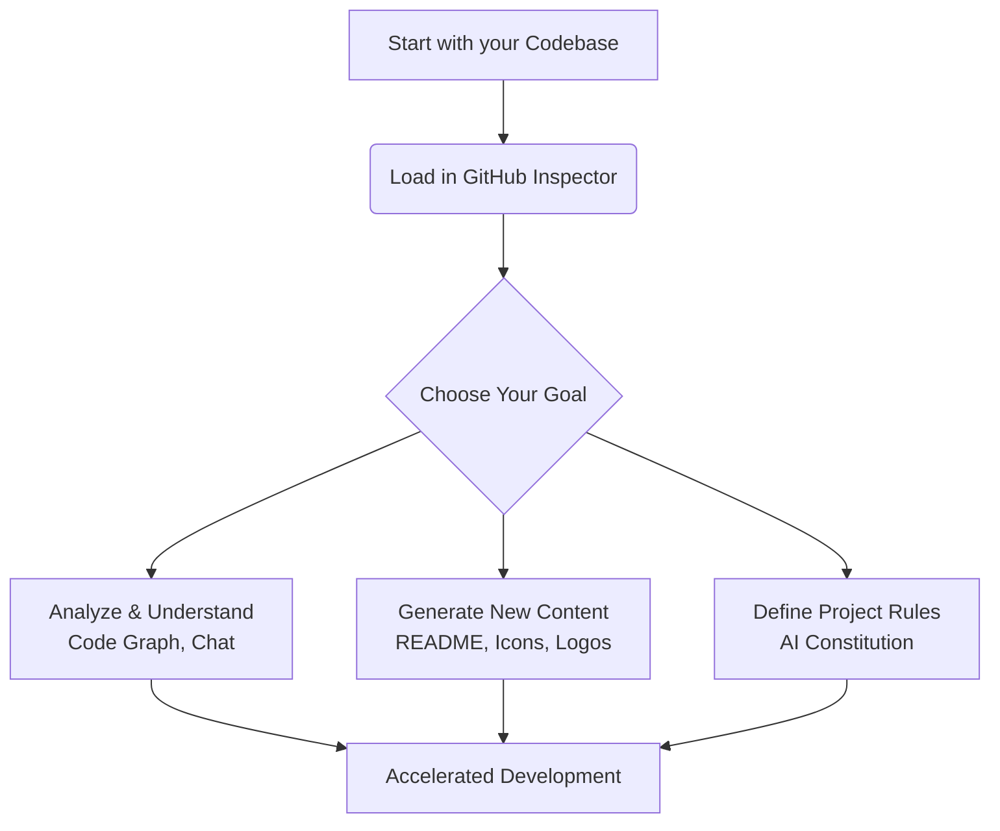

# Introduction to DevKit AI Pro 🚀

**Welcome to DevKit AI Pro, your all-in-one, AI-powered toolkit for modern software development.**

DevKit AI Pro is a sophisticated, locally-run application designed to act as a powerful assistant and collaborator in your development workflow. It integrates the state-of-the-art Google Gemini API with a suite of specialized AI agents that can understand the context of your code to help you chat, document, analyze, and create with unprecedented efficiency.

Whether you're looking to generate boilerplate code, create professional documentation, understand a complex codebase, or design assets for your project, DevKit AI Pro provides the tools and intelligence you need to accelerate your work.

---

## ✨ Key Features

Our goal is to provide a comprehensive toolkit that covers the entire development lifecycle.

| Feature                  | Description                                                                                                                   |
| :----------------------- | :---------------------------------------------------------------------------------------------------------------------------- |
| **Context-Aware Chat**     | A professional chat interface where AI agents can access staged files from your repository for highly relevant answers.         |
| **GitHub Inspector**       | Load any public GitHub repository to analyze its structure and stage specific files or folders as context for the AI.          |
| **README Pro Generator**   | Automatically generate a professional, well-structured `README.md` file based on your project's code and description.           |
| **AI Project Constitution**| Define coding standards and architectural rules for your project that other AI agents can follow.                             |
| **Code Graph Visualizer**  | Generate an interactive dependency graph to visualize the architecture of your repository.                                    |
| **Icon & Logo Generation** | Create unique, AI-generated icons, logos, and banners for your project using the Imagen 3 model.                              |
| **Agent Memory**           | Inspect and manage the long-term memories of each agent to see what they've learned from your feedback.                         |
| **Fine-Grained Control**   | Customize the parameters for every AI agent—from temperature to tools like Google Search—in the Settings view.                |

> **💡 Pro Tip:** To understand how these features work together, read about the [**Core Concepts**](./03-core-concepts.md) and the agentic workflow that powers the application.

This documentation will guide you through each of these features, explain the core concepts that power the application, and provide best practices to help you get the most out of your new AI assistant.

---
*Version 1.2.1*