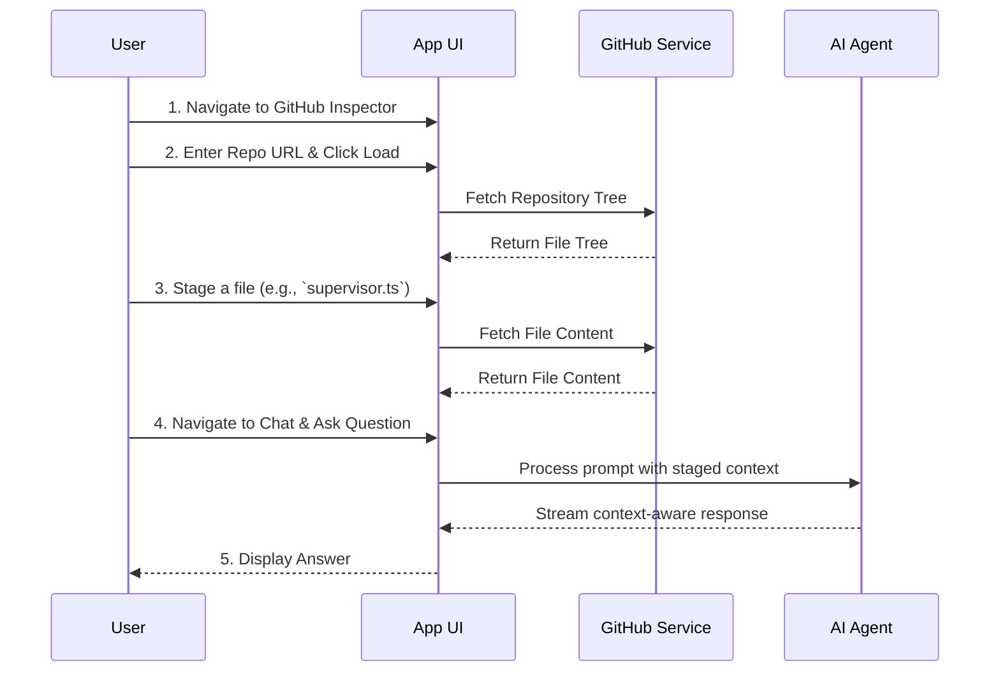

# Getting Started: Your First 5 Minutes

This guide will walk you through the essential first steps to get up and running with DevKit AI Pro. We'll load a repository, stage some files for context, and ask the AI a question about our code.

---

### Step 1: Navigate to the GitHub Inspector

The first step in using DevKit AI Pro effectively is to provide it with context. The primary way to do this is by loading a GitHub repository.

1.  Click on the **GitHub Inspector** tab in the sidebar under the "PROJECT" section.
2.  You'll see a field to enter a repository URL. For this example, you can use the default URL or enter any public GitHub repository you'd like to explore.
3.  Click the **Load Repository** button. The application will fetch the repository's file tree and display it in the right-hand panel.

> **💡 Pro Tip:** For private repositories or to avoid rate limits, you can add a Personal Access Token (PAT). Learn more in the [**Troubleshooting Guide**](./11-troubleshooting.md).

### Step 2: Stage Files for Context

Staging a file means you are selecting its content to be included in the context for the AI. This is the most crucial step for getting accurate, project-specific answers. For a deeper dive, read the [**GitHub Inspector**](./05-github-inspector.md) guide.

1.  In the repository structure panel, browse through the files and folders.
2.  Click the `+` icon next to a file (e.g., `services/supervisor.ts`) to stage it.
3.  You will see the file appear in the **Staged Files** panel on the left.
4.  You can also stage an entire folder by clicking the `+` icon next to its name.

### Step 3: Start a Chat

Now that we've provided context, let's ask the AI a question.

1.  Navigate to the **Chat** view using the sidebar.
2.  In the chat input at the bottom, type a question related to the file you just staged. For example:
    > "Based on the `supervisor.ts` file, what is the purpose of the `handleRequest` function?"
3.  Press Enter or click the send button.

### Step 4: Review the Response

The AI will process your request. Because you provided the content of `supervisor.ts`, it won't give you a generic answer about functions named `handleRequest`. Instead, it will provide a detailed explanation based *specifically on the code in that file*.

You'll also notice the **Agent Thoughts** panel, which gives you a peek into the AI's reasoning process before it formulates a final answer.

---

**Congratulations!** You've just completed your first context-aware interaction with DevKit AI Pro. You can now explore other features like the **README Pro Generator** or the **Code Graph**, which will automatically use the context from your loaded repository.

---
*Version 1.3.0*
