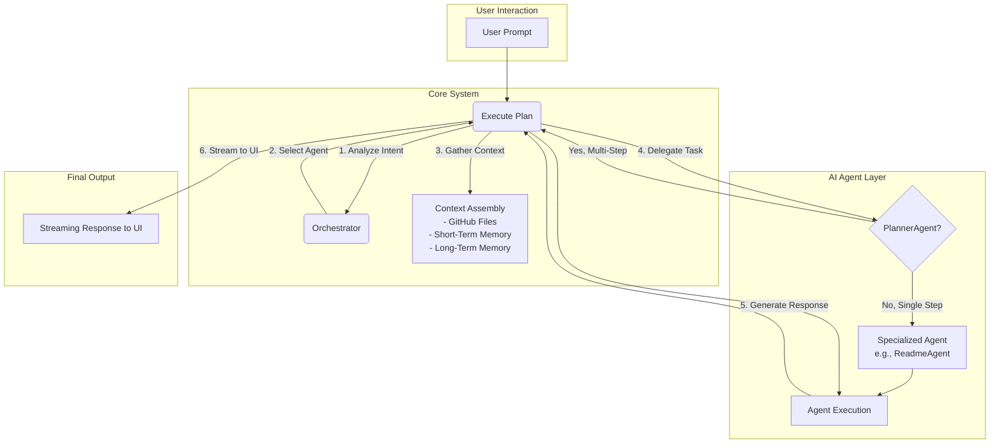

# Core Concepts: The Agentic Workflow

DevKit AI Pro is built on an **agentic architecture**. Instead of a single, monolithic AI model, your requests are handled by a team of specialized AI agents, each with a unique purpose, persona, and skillset. Understanding this workflow is key to mastering the application.

---

### 1. The Supervisor & Orchestrator: The Management Team

At the heart of the system are two central components that manage the entire AI workflow.

#### The Orchestrator
When you submit a prompt, the **Orchestrator** is the first to analyze it. Its sole purpose is to determine your *intent*. Is this a general question? A request to generate a file? A command to control the application?

Based on its analysis, the Orchestrator selects the single best agent for the job from the available roster and passes its decision to the Supervisor. To learn more about each agent's specialty, see the [**Meet the Agents**](./04-the-agents.md) guide.

#### The Supervisor
The **Supervisor** acts as the project manager for the AI team. Its responsibilities include:

1.  **Context Assembly:** It gathers all necessary context for the task, including:
    -   Content from your staged GitHub files via the advanced RAG system.
    -   Recent conversation history (short-term memory).
    -   Learned facts and feedback from past sessions (long-term memory).
2.  **Agent Delegation:** It receives the agent choice from the Orchestrator and formally assigns the task.
3.  **Tool Management:** If an agent needs to use a tool (like Google Search or Function Calling), the Supervisor facilitates this, executing the tool and returning the results to the agent.
4.  **Plan Execution:** If the chosen agent is the `PlannerAgent`, the Supervisor oversees the execution of the multi-step plan, ensuring the output from one step is correctly passed as input to the next.

### 2. Context is Key

The power of DevKit AI Pro comes from its ability to understand your project. By using the [**GitHub Inspector**](./05-github-inspector.md) to load a repository and **stage files**, you provide the AI agents with the same context a human developer would have. This allows them to:

-   Adhere to your project's coding style and conventions.
-   Understand your existing architecture and dependencies.
-   Generate code that integrates seamlessly with your codebase.

Without context, the AI can only provide generic answers. With context, it becomes a true pair programmer.

### 3. Memory & Learning

The system uses two types of memory to improve its performance over time.

-   **Short-Term Memory:** The AI remembers the last few turns of your current conversation, allowing it to understand follow-up questions and maintain a natural conversational flow.
-   **Long-Term Memory:** When you provide feedback (👍/👎) on an AI's response, the `Supervisor` triggers a process of reflection. The AI analyzes the feedback and the preceding conversation to extract a key takeaway. This "memory" is stored and retrieved in future sessions to avoid repeating mistakes and remember your preferences. You can view these learned memories in the **Agent Memory** tab.

### 4. Advanced RAG & Vector Search

When you stage a file, DevKit AI Pro doesn't just store its text. It initiates a sophisticated **Retrieval-Augmented Generation (RAG)** pipeline to create a searchable knowledge base of your code.

1.  **Intelligent Filtering**: Before indexing, common non-code files and directories (like `.git`, `node_modules`, `dist`, `build`, `.lock` files) are automatically ignored. This keeps the vector cache clean and relevant.
2.  **Chunking:** The content of a staged file is broken down into small, overlapping text chunks.
3.  **Embedding:** Each chunk is sent to the Gemini embedding model (`gemini-embedding-001`). We use several optimizations for production-grade quality:
    -   **Task Type:** Code chunks are embedded using the `RETRIEVAL_DOCUMENT` task type.
    -   **Optimal Dimensions:** We use **1536 dimensions** for the embedding vector, which provides the best balance of quality and performance according to MTEB benchmarks.
    -   **Normalization:** The resulting vectors are **normalized** before being stored, a critical step for ensuring high-accuracy similarity search.
4.  **Vector Cache:** These vectors and their corresponding text chunks are stored in a local, in-browser vector database.
5.  **Retrieval:** When you ask a question about your code, your query is embedded using the specialized `CODE_RETRIEVAL_QUERY` task type. This creates a vector specifically optimized for finding relevant code.
6.  **Similarity Search:** The application performs a lightning-fast cosine similarity search on the vector cache to find the most relevant code chunks.
7.  **Context Assembly:** The top-matching chunks are retrieved and injected into the final prompt for the AI agent.

This advanced RAG system means that even if you stage an entire repository, the AI receives a small, highly-focused, and semantically relevant context, leading to faster, more accurate, and more cost-effective answers.

---
*Version 1.8.0*