# Meet the Agents: Your Specialized AI Team

The power of DevKit AI Pro lies in its roster of specialized agents. Each agent is an AI with a unique persona, a specific task, and a tailored configuration. The **Orchestrator** automatically selects the best agent for your request, but understanding their roles can help you craft more effective prompts.

> **💡 Pro Tip:** You can fine-tune the parameters for every agent (like temperature, creativity, and tools) in the [**Settings & Customization**](./07-settings-and-customization.md) view.

```mermaid
mindmap
  root((DevKit AI Agents))
    ::icon(🤖)
    **General & Orchestration**
      ChatAgent
      PlannerAgent
      FunctionCallingAgent
    **Content & Code**
      ReadmeAgent
      ProjectRulesAgent
      CodeExecutionAgent
      StructuredOutputAgent
      CodeGraphAgent
    **GitHub Pro**
      PullRequestAgent
      IssueLabelAgent
    **Research & Refinement**
      ResearchAgent
      RefinerAgent
      UrlAgent
    **Creative & System**
      IconPromptAgent
      ImageRefinementAgent
      MemoryAgent
      ContextRetrievalAgent
      MemoryConsolidationAgent
```

---

### General & Orchestration Agents

| Agent Name            | Purpose & Best Use Case                                                                                                                              |
| :-------------------- | :--------------------------------------------------------------------------------------------------------------------------------------------------- |
| **`ChatAgent`**         | Your primary conversational partner. It's a highly capable generalist, perfect for coding questions, debugging, brainstorming, and explanations. Now equipped with a GitHub Code Search tool.      |
| **`PlannerAgent`**      | The master strategist. It deconstructs complex, multi-step tasks (e.g., "research a topic and then write code about it") into a logical plan for other agents to execute. It is chosen automatically for complex requests. |
| **`FunctionCallingAgent`** | An application controller. It uses tools to perform actions within the app itself. Use it for commands like "navigate to the settings view" or "change the temperature of the ReadmeAgent to 0.8". |

---

### Content & Code Generation Agents

| Agent Name                | Purpose & Best Use Case                                                                                                                                                                   |
| :------------------------ | :---------------------------------------------------------------------------------------------------------------------------------------------------------------------------------------- |
| **`ReadmeAgent`**           | A technical writer specialist. It excels at generating professional, well-structured `README.md` files for your projects. This agent powers the "README Pro" view.                   |
| **`ProjectRulesAgent`**     | An AI software architect. It analyzes your entire codebase to generate a "Project Constitution"—a document outlining coding standards, patterns, and style guides that other AIs can follow. Powers the "AI Project Constitution" view. |
| **`CodeExecutionAgent`**    | A Python programmer. It can write and execute Python code in a sandboxed environment to solve complex computational problems, perform data analysis, or answer logic-based questions. |
| **`StructuredOutputAgent`** | A data API. Ask it to format information into a specific JSON structure. For example, "list the top 5 sci-fi movies of all time as a JSON array." Its output schema can be configured in Settings. |
| **`CodeGraphAgent`**        | A code analyst. It reads your file structure and generates the data needed to visualize your project's architecture in the "Code Graph" view.                                           |

---

### GitHub Pro Agents

| Agent Name                | Purpose & Best Use Case                                                                                                                                                                   |
| :------------------------ | :---------------------------------------------------------------------------------------------------------------------------------------------------------------------------------------- |
| **`PullRequestAgent`**      | An expert code reviewer. It analyzes the changes in a pull request and provides a detailed review, covering bugs, style, and best practices. Powers the "PR Reviewer" tool.              |
| **`IssueLabelAgent`**       | An AI triage engineer. It analyzes a GitHub issue's content and automatically suggests and applies the most relevant labels from your repository, streamlining project management.     |

---

### Research & Refinement Agents

| Agent Name        | Purpose & Best Use Case                                                                                                                          |
| :---------------- | :----------------------------------------------------------------------------------------------------------------------------------------------- |
| **`ResearchAgent`** | A research analyst that uses the Google Search tool to answer questions about recent events or provide up-to-date information from the web.       |
| **`RefinerAgent`**  | A technical editor. Give it any piece of text and an instruction (e.g., "make this more professional" or "shorten this paragraph"), and it will first critique the original text and then provide an improved version. |
| **`UrlAgent`**      | A web page reader. Provide it with one or more URLs and ask it to summarize, compare, or answer specific questions about their content. (Note: This is a conceptual agent for processing URL data). |

---

### Creative & Design Agents

| Agent Name                | Purpose & Best Use Case                                                                                                                                  |
| :------------------------ | :------------------------------------------------------------------------------------------------------------------------------------------------------- |
| **`IconPromptAgent`**       | An expert art director. It takes a simple idea (e.g., "a logo for a space company") and generates three distinct, highly detailed, professional prompts for an AI image generator. |
| **`ImageRefinementAgent`**  | A multimodal creative assistant. It analyzes a generated image and your text feedback to create a new, improved prompt, enabling an iterative design workflow. |

---

### System & Memory Agents

| Agent Name                     | Purpose & Best Use Case                                                                                                                                                                                             |
| :----------------------------- | :---------------------------------------------------------------------------------------------------------------------------------------------------------------------------------------------------------------- |
| **`ContextRetrievalAgent`**    | The central "retrieval processor." Before a primary agent runs, this agent queries all memory tiers (Working, Episodic, Semantic) to assemble a rich, comprehensive context package.                               |
| **`MemoryConsolidationAgent`** | The "consolidation processor." This agent reads raw conversation history (Episodic Memory) and extracts key facts or preferences, creating clean summaries to be stored in the long-term Knowledge Base (Semantic Memory). |
| **`MemoryAgent`**              | A low-level system agent responsible for checking memory novelty and performing summarization tasks. It is called by other services and is not intended for direct user interaction.                                      |

---
*Version 1.9.0*
