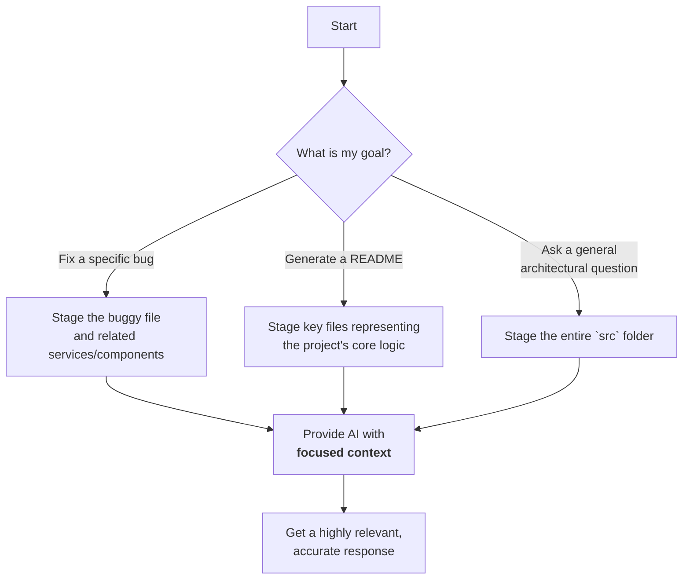

# GitHub Inspector: Providing Context to the AI

The **GitHub Inspector** is arguably the most important view in DevKit AI Pro. It's the bridge between your project's source code and the AI's understanding. By loading a repository and "staging" files, you are providing the critical context the AI needs to give you relevant, accurate, and useful answers.

---

### How to Use the GitHub Inspector

#### 1. Loading a Repository
-   **URL Input:** Enter the full URL of any public GitHub repository.
-   **API Key (Optional):** The GitHub API has rate limits for unauthenticated requests. If you plan to use the inspector frequently or with very large repositories, it's highly recommended to provide a [Personal Access Token (PAT)](https://docs.github.com/en/authentication/keeping-your-account-and-data-secure/managing-your-personal-access-tokens). This increases your rate limit significantly. The key is stored securely in your browser's local storage.
-   Click **Load Repository**. The file tree will appear on the right.

#### 2. Staging and Unstaging Files
Once the file tree is loaded, you can choose which parts of the project to include in the AI's context.

-   **Staging a Single File:** Click the `+` icon next to a file's name. Its content will be fetched and added to the context. A green checkmark will appear next to it.
-   **Staging a Folder:** Click the `+` icon next to a folder's name. All files within that folder and its subfolders will be fetched and added to the context.
-   **Unstaging:** To remove an item from the context, you can either:
    -   Click the `X` icon next to a folder to unstage all files within it.
    -   Go to the "Staged Files" panel and click the minus icon next to an individual file.

> **⚠️ Warning:** Be mindful when using the "Stage All" button on large repositories. Sending a large amount of context to the AI can be slow and may result in higher API costs. It's always best to be selective and only stage the files relevant to your current task.

The **Staged Files** panel gives you a clear overview of exactly what information will be sent to the AI.

---

### Why is Staging Files So Important?

Imagine asking a coworker for help with a bug, but not showing them the code. They could only give you generic advice. The AI works the same way.

**Without Context:**
> **You:** "How do I add error handling to my data fetching function?"
> **AI:** "You can use a try...catch block. Here is a generic JavaScript example..."

**With Context (after staging `useData.ts`):**
> **You:** "How do I add error handling to my data fetching function?"
> **AI:** "I see you're using a custom React hook called `useData` with the `fetch` API. To add error handling, you should modify the `useEffect` hook to include a `.catch()` block on your fetch promise and set an error state. Here is the refactored version of your specific hook..."

By providing context, you elevate the AI from a generic search engine to a true pair programmer that understands the nuances of your project.

---
*Version 1.3.0*
