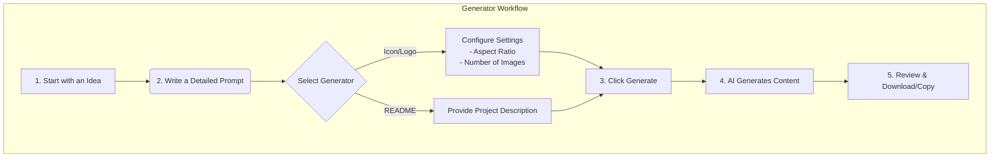

# Content Generators

DevKit AI Pro includes several powerful tools for generating content and assets, each powered by a specialized AI agent.

---

### README Pro Generator

This tool, powered by the `ReadmeAgent`, creates professional `README.md` files for your projects.

**How it Works:**
1.  **Load Your Repo:** First, ensure your project is loaded in the **GitHub Inspector**. The agent uses your file tree to infer the tech stack, installation steps, and key features.
2.  **Provide a Description:** In the "Project Details" card, write a clear, concise description of your project. Explain its purpose, the problem it solves, and its target audience. You can use one of the example prompts as a starting point.
3.  **Generate:** Click the "Generate README" button. The `ReadmeAgent` will analyze your description and the repository context to produce a well-structured, comprehensive README file, complete with sections for features, tech stack, installation, and more.
4.  **Copy:** Once you're satisfied, use the "Copy" button to paste the markdown into your project.

---

### Icon Generator & Logo/Banner Generator

These tools use Google's powerful **Imagen 3** model to create high-quality visual assets.

**How it Works:**
1.  **Write a Detailed Prompt:** The key to great images is a great prompt. Be as descriptive as possible. Instead of "a logo for a tech company," try "A sleek, duotone vector icon of a database, for a tech startup logo, blue and silver."
    -   **Style:** Use keywords like `vector icon`, `3D render`, `photorealistic`, `glassmorphism`.
    -   **Color:** Mention a specific color palette, like `warm earth tones` or `vibrant pastels`.
    -   **Composition:** Describe the layout, like `centered`, `isometric view`, or `dynamic angle`.
2.  **Configure Settings:**
    -   **Number of Images:** Generate up to 4 variations at once.
    -   **Aspect Ratio:** Choose the shape of your image. Use `1:1` for square icons and `16:9` for wide banners.
3.  **Generate:** Click the "Generate" button.
4.  **Download:** Hover over any generated image to download it as a PNG. You can also attempt to convert it to an SVG by clicking the SVG icon.

> **💡 Pro Tip:** Struggling with prompt ideas? Go to the **Chat** view and ask the `IconPromptAgent` for help! For example: "Generate 3 detailed prompts for a logo for a security company called 'Aegis'."

> **Note on SVG Conversion:** The PNG-to-SVG conversion is done in your browser using the Potrace algorithm. It works best for simple, high-contrast images like logos and icons. It may not produce good results for complex or photographic images.

---
*Version 1.3.0*
