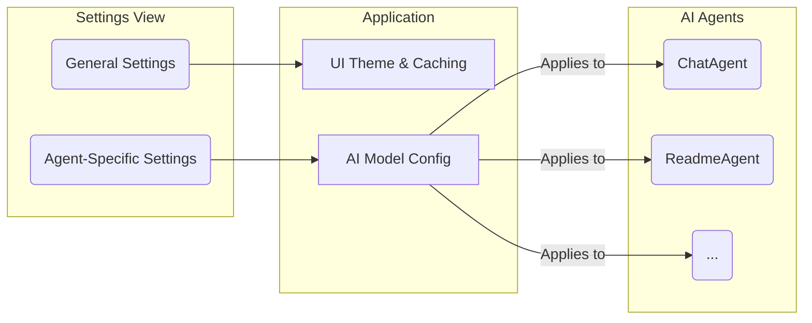

# Settings & Customization

The **Settings** view gives you granular control over the application's behavior and the parameters of each AI agent.

---

### General Settings

This tab allows you to customize the overall look and feel of the application.

-   **Agent Thoughts Visual Style:** Choose how the AI's internal monologue is displayed in the chat view. Experiment with different styles, from a clean default card to a retro terminal or a creative blueprint.
-   **Theme:** Switch between light and dark mode.
-   **Data Management:**
    -   **Enable Generation Cache:** When enabled, results from generators (like README Pro and Code Graph) are cached in your browser. This saves time and cost if you run the same generation again on the same project.
    -   **Clear Generation Cache:** Manually deletes all cached results.
    -   **Clear All Agent Memories:** Erases all learned long-term memories for every agent, effectively resetting their learning from your feedback.
    
> **⚠️ Warning:** Clearing agent memories is a destructive and irreversible action. The agents will lose all learned preferences and corrections from your past feedback. Use with caution.

---

### Agent-Specific Settings

Each agent has its own tab where you can fine-tune its configuration. This is for advanced users who want to experiment with the AI's performance.

#### Key Parameters

-   **Temperature:** Controls the "creativity" of the model. A lower value (e.g., `0.2`) makes the output more deterministic and focused, while a higher value (e.g., `0.9`) makes it more creative and unpredictable.
-   **Top-P / Top-K:** These parameters also control the randomness of the output by limiting the pool of possible next tokens the model can choose from. It's generally recommended to only modify one of `Temperature` or `Top-P`.
-   **Max Output Tokens:** Sets the maximum length of the AI's response.

#### Thinking Configuration
-   **Thinking Budget:** Controls the number of tokens the model can use for internal reasoning before generating a response. A higher budget can improve quality on complex tasks, but may increase latency. "Dynamic Thinking" (`-1`) allows the model to choose the budget automatically.
-   **Include Thought Process:** Toggles whether the agent's "thoughts" are streamed to the UI.

#### Tools
-   **Google Search Grounding:** Allows the agent to search the web to answer questions that require up-to-date information.
-   **Code Execution:** Allows the agent to write and run Python code in a sandboxed environment.
-   **Structured Output (JSON Schema):** For agents like `StructuredOutputAgent`, you can provide a specific JSON schema here to force the output into a desired structure.

---
*Version 1.2.1*