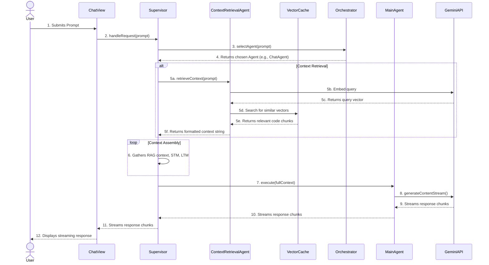

# Architecture Overview

This document provides a technical overview of the DevKit AI Pro application, its core components, and the data flow for a typical AI request.

## 1. High-Level Design

The application is a single-page application (SPA) built with **React** and **TypeScript**. Its architecture is designed around three core principles:
- **Modularity:** Functionality is broken down into distinct, reusable components and services.
- **Agentic Design:** Complex AI tasks are handled not by a single model, but by a collection of specialized **Agents**, each with a unique purpose, configuration, and toolset.
- **Context-Awareness:** The system uses an advanced Retrieval-Augmented Generation (RAG) pipeline to deeply integrate with a developer's project context.

> **💡 Architectural Note:** The agentic design allows for greater maintainability and specialization. Instead of trying to perfect one massive system prompt, we can fine-tune each agent's persona and configuration independently for its specific task, leading to higher-quality results.

## 2. Core Components & Directory Structure

-   `/components`: Reusable React components (`Button`, `Card`, `Sidebar`, etc.).
-   `/context`: React Context providers for managing global state (`GithubContext`, `SettingsContext`).
-   `/agents`: The heart of the AI system. Each file defines a specialized `Agent` with its own system prompt, configuration, and execution logic.
-   `/services`: Core logic for interacting with external APIs and managing application state.
-   `/views`: Top-level components that represent the different screens or "tools" of the application (`ChatView`, `ReadmeView`, etc.).
-   `/docs`: Contains all markdown-based documentation files and the `manifest.json`.

### Key Services

-   `gemini.service.ts`: A lightweight wrapper around the `@google/genai` SDK.
-   `embedding.service.ts`: Handles creating vector embeddings for text.
-   `vector-cache.service.ts`: An in-browser vector database using IndexedDB.
-   `github.service.ts`: Handles all interactions with the GitHub API.
-   `agent.service.ts`: Manages the state of all available agents and their configurations.
-   `orchestrator.ts`: Analyzes user intent to select the most appropriate agent.
-   `supervisor.ts`: The central controller for all AI interactions.
-   `short-term-memory.service.ts`: A simple in-memory store for the current conversation.
-   `agent-memory.service.ts`: Manages long-term memories in IndexedDB.

## 3. The RAG Workflow: A Request's Lifecycle

This sequence describes what happens when a user sends a message from the `ChatView`.

1.  **Request Initiation (`ChatView.tsx`):** The user's prompt is captured and `supervisor.handleRequest()` is called.

2.  **Agent Selection (`orchestrator.ts`):** The `supervisor` first calls `orchestrator.selectAgent()` to determine the best agent for the user's intent.

3.  **Context Retrieval (`supervisor.ts` & `ContextRetrievalAgent.ts`):** The `supervisor` invokes the `ContextRetrievalAgent`. This agent embeds the user's query and searches the `vector-cache` for the most semantically similar code chunks from the staged files.

4.  **Context Assembly (`supervisor.ts`):** The `supervisor` gathers all available context: the retrieved code chunks from the RAG step, short-term memory (conversation history), and long-term memory (learned facts).

5.  **Execution Planning (`supervisor.ts`):**
    -   **If the agent is `PlannerAgent`:** A multi-step workflow is initiated.
    -   **If the agent is any other agent:** A single-step workflow is executed.

6.  **Agent Execution (`agents/*.ts`):** The `supervisor` calls the `.execute()` method on the chosen agent, passing the fully assembled context. The agent makes a streaming call to the Gemini API.

7.  **Response Streaming (`ChatView.tsx`):** The `ChatView` consumes the stream from the `supervisor` and updates the UI in real-time.

8.  **Memory Consolidation (`supervisor.ts`):** After the turn is complete, the `supervisor` may trigger the `MemoryAgent` to summarize the interaction and save any important information to long-term memory.

---
*Version 1.6.0*