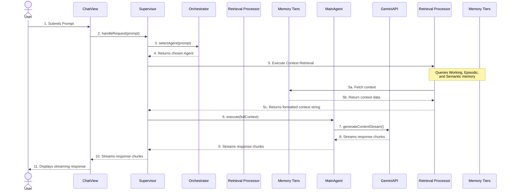

# Architecture Overview

This document provides a technical overview of the DevKit AI Pro application, its core components, and the data flow for a typical AI request.

## 1. High-Level Design

The application is a single-page application (SPA) built with **React** and **TypeScript**. Its architecture is designed around three core principles:
- **Modularity:** Functionality is broken down into distinct, reusable components and services.
- **Agentic Design:** Complex AI tasks are handled not by a single model, but by a collection of specialized **Agents**.
- **Cognitive Architecture:** The system uses a multi-tiered memory system (Working, Episodic, Semantic) managed by dedicated **Memory Processor** agents to provide deep contextual understanding.

## 2. Core Components & Directory Structure

-   `/components`: Reusable React components.
-   `/context`: React Context providers for global state.
-   `/agents`: The heart of the AI system. Each file defines a specialized `Agent`.
-   `/services`: Core logic for external APIs and managing the three memory tiers.
-   `/views`: Top-level components representing the app's different screens.

### Key Services

-   `gemini.service.ts`: Wrapper around the `@google/genai` SDK.
-   `supervisor.ts`: The central controller that manages the overall execution flow.
-   `orchestrator.ts`: Analyzes user intent to select the best agent.
-   `working-memory.service.ts`: Manages the volatile, task-specific "scratchpad."
-   `history.service.ts`: Manages the chronological log of conversation (Episodic Memory).
-   `knowledge.service.ts`: Manages the long-term vector store (Semantic Memory).
-   `agent-memory.service.ts`: Manages learned memories from user feedback.

## 3. The Cognitive Workflow: A Request's Lifecycle

This sequence describes what happens when a user sends a message from the `ChatView`.

1.  **Request Initiation (`ChatView.tsx`):** The user's prompt is captured, and the `supervisor` clears the **Working Memory** for the new task.

2.  **Agent Selection (`orchestrator.ts`):** The `supervisor` calls the `orchestrator` to determine the user's intent and select the best primary agent.

3.  **Context Retrieval (`ContextRetrievalAgent.ts`):** The `supervisor` delegates context assembly to the **Retrieval Processor**. This agent systematically queries all three memory tiers:
    -   It fetches the current plan from **Working Memory**.
    -   It gets the last few messages from **Episodic Memory** (the chat history).
    -   It performs a vector search on **Semantic Memory** (the knowledge base) for relevant facts and code.

4.  **Agent Execution (`agents/*.ts`):** The `supervisor` passes the rich, formatted context from the retrieval agent to the primary agent's `.execute()` method. The agent makes a streaming call to the Gemini API.

5.  **Response Streaming (`ChatView.tsx`):** The `ChatView` consumes the stream from the `supervisor` and updates the UI in real-time. The `supervisor` also updates the **Working Memory** with any new observations or thoughts from the agent.

6.  **Memory Consolidation (Optional):** After the turn, a **Consolidation Processor** (`MemoryConsolidationAgent`) can be triggered to analyze the chat history, extract key insights, and save them as new facts in the **Semantic Memory**, allowing the AI to learn from the conversation.

---
*Version 1.9.0*
