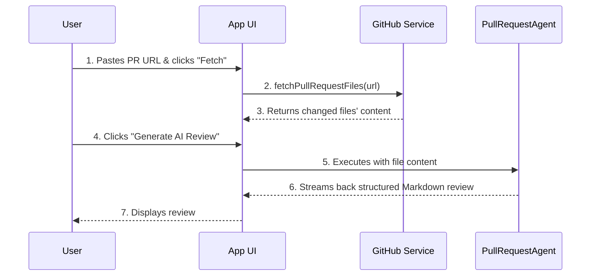

# GitHub Pro: Pull Request Reviewer

The Pull Request (PR) Reviewer is a powerful tool in the **GitHub Pro** suite that leverages a specialized AI agent to automate code reviews, helping you maintain high code quality and streamline your development workflow.

---

### How it Works

The PR Reviewer, powered by the `PullRequestAgent`, performs a comprehensive analysis of the code changes in a given pull request.

1.  **Input a URL:** Provide the URL of any public GitHub pull request.
2.  **Fetch Files:** The application's `github.service` will contact the GitHub API to fetch a list of all changed files in the PR and their full content.
3.  **AI Analysis:** This content is then passed to the `PullRequestAgent`. This agent has a detailed system prompt instructing it to act as an expert Staff Engineer and review the code across several critical dimensions:
    -   Correctness & Bugs
    -   Best Practices & Design Patterns
    -   Readability & Maintainability
    -   Security Vulnerabilities
    -   Performance
4.  **Generate Review:** The agent streams back a professional, structured code review in Markdown format. The review includes a high-level summary and a detailed, file-by-file list of suggestions, each categorized by severity.

### Best Practices for Using the PR Reviewer

-   **Use as a "First Pass":** The AI reviewer is an excellent tool for catching common mistakes, style inconsistencies, and potential bugs before a human reviewer spends time on it. It acts as an automated "first pass" to improve the quality of the code that reaches your team.
-   **Focus on the "Why":** Pay attention to the reasoning behind the AI's suggestions. It's a great way to learn about new best practices or potential pitfalls you might not have considered.
-   **Combine with Human Expertise:** The AI is a powerful assistant, but it is not a replacement for the nuanced understanding of a human developer who knows the project's long-term goals. Use the AI's output as a starting point for your own review.
-   **Provide Feedback:** If the review is particularly helpful or unhelpful, use the main **Chat** view to give feedback. This can help improve the underlying models over time.

---
*Version 1.3.0*
