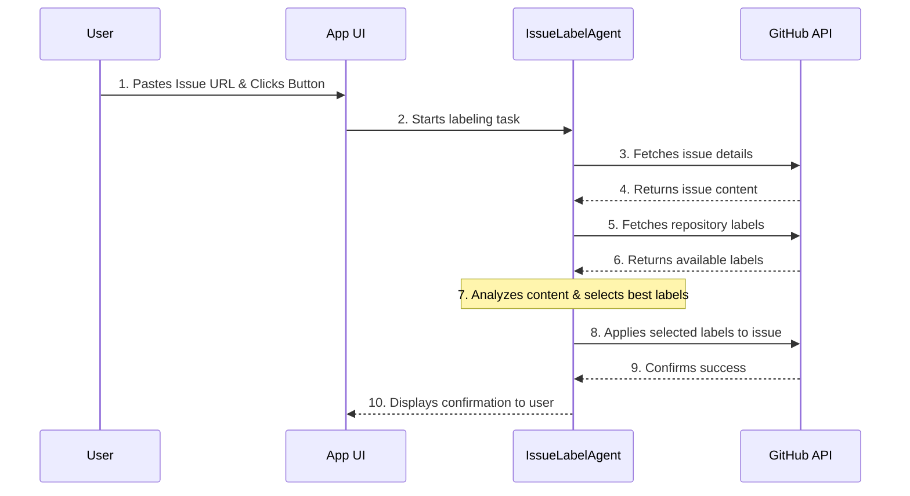

# GitHub Pro Tools

The **GitHub Pro** section is your hub for advanced tools that deeply integrate with the GitHub platform to automate and accelerate common development workflows.

These tools are designed to be flexible. While they are always accessible, their most powerful features are unlocked when you provide a **GitHub Personal Access Token (PAT)** in the **GitHub Inspector** view. Features that require a key will be disabled with a helpful tooltip, guiding you to enable them.

---

## 1. My Pull Requests & Reviewer

This tool, powered by the `PullRequestAgent`, helps you conduct thorough, AI-assisted code reviews.

### Workflow
1.  **Add API Key:** To use the "My Pull Requests" feature, first add your GitHub PAT in the **GitHub Inspector**.
2.  **Fetch Your PRs:** Navigate to the "My Pull Requests" tab and click "Refresh". The app securely fetches a list of all open pull requests currently assigned to you.
3.  **One-Click Review:** Select any PR from the list. The tool automatically fetches the changed files.
4.  **Generate Review:** Click "Generate AI Review". The `PullRequestAgent` will analyze the code for correctness, best practices, readability, and security, and provide a structured, actionable review.

> **💡 Pro Tip:** Even without an API key, you could manually copy a public PR's files into the chat context and ask the `PullRequestAgent` to perform a review. The "My Pull Requests" feature simply automates this entire process.

---

## 2. AI Issue Labeler

This tool, powered by the `IssueLabelAgent`, automates the often tedious task of triaging and labeling new GitHub issues.

### Workflow
1.  **Add API Key:** This feature is API-dependent and requires a PAT.
2.  **Input Issue URL:** Paste the URL of any issue from a repository you have access to.
3.  **Suggest & Apply Labels:** Click the "Suggest & Apply Labels" button. The workflow is as follows:
    a.  The app first fetches the issue's title and body content.
    b.  It then fetches the complete list of available labels for that specific repository.
    c.  The `IssueLabelAgent` analyzes the issue content and compares it against the available labels to determine the best fit (e.g., `bug`, `feature`, `documentation`).
    d.  It then calls the GitHub API to apply these labels to the issue.
4.  **Confirmation:** The agent will confirm which labels have been successfully applied.

---

## 3. Repository Search

This tool allows you to discover and quickly load new projects without leaving the application.

### Workflow
1.  **Add API Key:** This feature is API-dependent and requires a PAT.
2.  **Enter a Query:** Type a search term (e.g., "react component library").
3.  **Search:** The app searches all of public GitHub, sorting results by stars.
4.  **Load in Inspector:** Click the "Load in Inspector" button on any result. The app will automatically navigate you to the **GitHub Inspector** view and begin loading that repository's file tree, making it immediately available for analysis.

---
*Version 1.4.0*
