# Workflow Token Tracking

DevKit AI Pro automatically tracks the token usage for every step in a multi-agent workflow plan. This provides transparency into the "cost" of each operation, helping you understand the complexity and API usage of your requests.

---

## Where to Find Token Counts

Whenever a multi-step plan is executed by the `PlannerAgent`, the **Workflow Visualizer** will appear in the Chat view.

As each step in the plan completes, you will see a small gray box with a number and the word "tokens" appear next to the agent's name.

```mermaid
graph TD
    A["Workflow Step (Completed)"]
    subgraph "UI Display"
        B["✅ ReadmeAgent"] -- contains --> C["1250 tokens"];
    end
    A --> B
```

-   **Total Tokens:** The number shown is the `totalTokenCount` for that specific step, including input, output, and any "thinking" tokens.
-   **Detailed Breakdown:** For a more detailed view, simply **hover your mouse over the token count**. A tooltip will appear showing the breakdown:
    -   **Input:** Tokens in the prompt sent to the model.
    -   **Output:** Tokens in the generated response.
    -   **Thoughts:** (If applicable) Tokens used for the model's internal reasoning.

## Why is This Useful?

-   **Cost Awareness:** Since Gemini API usage is billed by the token, this feature gives you a direct insight into which agents and tasks are the most resource-intensive.
-   **Performance Analysis:** A very high input token count might indicate that a large amount of context was sent, which could increase latency.
-   **Prompt Engineering:** You can see how changes in your prompts or the amount of staged context affect the token count for different agents, helping you optimize your requests.

---
*Version 1.5.0*
